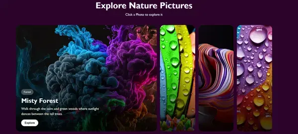

# Explore Nature Pictures

A modern, responsive and interactive gallery to discover the beauty of nature.

Click on a photo to explore its story.

### 🔗 Live Demo
https://YaSaMaN-Za.github.io/Nature-cards/

### 📸 Preview

### ✨ Features
- Interactive Cards: Smooth expand animation on click
- Fully Responsive: Works perfectly on mobile, tablet, and desktop
- Clean UI: Minimalist design with focus on photography
- Lightweight: Built with pure HTML, CSS, and Vanilla JS - no frameworks

### 🛠️ Built With
- HTML5
- CSS3 (Flexbox, Transitions)
- JavaScript (ES6)

### 📁 How to run
Just clone and open index.html:
`bash
git clone https://github.com/YaSaMaN-Za/Nature-cards.git